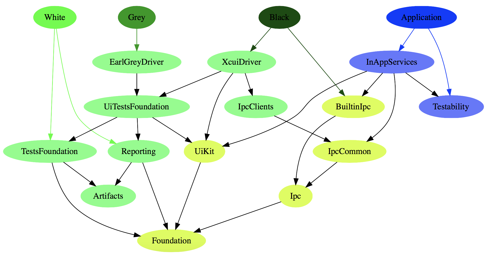

# Frameworks

Mixbox is designed to support multiple kinds of tests. Assume that you have an "Application" target and test targets ("White", "Grey", and "Black").

Due to high amount of possible targets there are so many frameworks.

(note that currently only "Black" is somehow usable)

The way that frameworks are divided may be changed in future.

White-box tests target (e.g. unit tests) may use this:

* **TestsFoundation**: contains code that can be used for every iOS test, e.g. cleaning system state, working with XCTest, etc.
* **Reporting**, **Artifacts**: based on the picture alone they can be combined with TestsFoundation, however at Avito we use them separately for other frameworks.
* **Foundation**: just very generic utilities that are used in almost every other framework.

Grey-box tests target may use this:

* **EarlGreyDriver**: An implementaion of UI testing based on EarlGrey
* **UiTestsFoundation**: Shared interfaces for UI testing and tools for UI testing. Shared interfaces allow to share also your code, e.g. your page objects.
* **UiKit**: Same as Foundation, but requires UIKit
 No newline at end of file
 
Black-box tests target may use this:

* **XcuiDriver**: An implementaion of UI testing based on XCUI
* **IpcClients**: Clients for communication with the Application, for example to get data or simulate something like keyboard/touches/push notifications/etc.
* TBD

Application should provide some extra information for tests, it will use:

* **InAppServices**: a facade for everything that is related for supporting tests
* **Testablity**: interfaces that can make your app testable. Why it is a separate framework: you can use it in other frameworks, for example, in frameworks with UI modules (view controllers).

Some code is shared between tests and app:
* **Ipc**: abstraction over IPC, e.g.: "send me data".
* **BuiltinIpc**: implementation.
* **IpcCommon**: interfaces of specific IPC, e.g.: "send me percentage of visible area".

